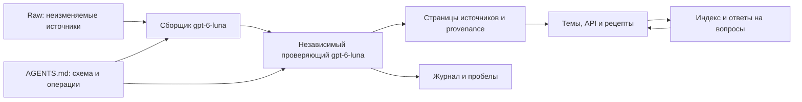

# Обзор базы знаний и архитектура

База компилирует сведения из исходных документов, SDK, библиотек, инструментов сборки, плагинов и клиентов-доноров. У каждого источника есть версия, область чтения, доказательства и независимая проверка. Канонические темы связывают знания; детализация методов остается доступной по первоисточникам.

## Как выбирать материал

- Обычный Python-плагин: [workflow](topics/workflow.md), [жизненный цикл](topics/lifecycle.md), [хуки](topics/hooks.md), [настройки/UI](topics/ui.md).
- Запросы и данные: [TLRPC](topics/requests.md), [несколько аккаунтов](topics/accounts.md), [очереди](topics/threading.md), [хранилища](topics/storage.md).
- Большой проект и DEX: [сборка](topics/build.md), [границы доверия](topics/security.md), [диагностика](topics/debug.md), [совместимость](topics/portability.md).
- Пользовательские функции и портирование: [media](topics/media.md), [network](topics/network.md), [AI](topics/ai.md), [распространение](topics/distribution.md).

## Уровни доказательств

`code` — факт найден в конкретном снимке кода. `docs` — утверждение документации. `secondary` — радарный пересказ. `inference` — объясненный вывод составителя. `unavailable` — материал недоступен. `runtime-verified` требует отдельного зафиксированного опыта в указанном клиенте. В этой работе приложения и плагины на устройстве не запускались.

Различия платформ сохраняются. Android BasePlugin, iOS runtime и Desktop PLEngine не образуют единого SDK по сходству названий. Номера SDK и требования отдельных страниц также сохраняются раздельно.

[Индекс](index.md) · [Рецепты](recipes/index.md) · [API](apis/index.md) · [Реестр](source-registry.md) · [Пробелы](gaps.md) · [Журнал](log.md)
